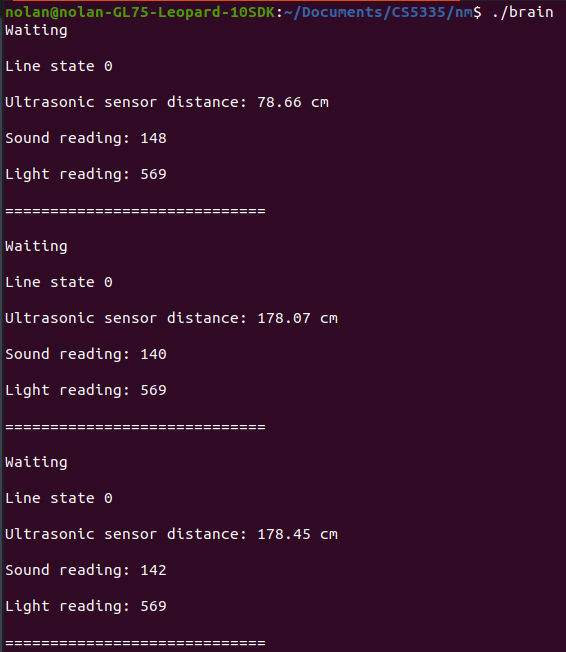

# 🤖 Serial communication between mBot Ranger and C++ program via USB.
## Description
This guide is intended to demonstrate how to send data from the mBot ranger to a computer via USB. The mBot relies on an ultrasonic sensor, line follower, sound, and light sensor. The C++ file was based on Professor Tuck's partial C++ implementation: https://github.com/NatTuck/cs5335hw-gazebo/blob/master/ranger/gz-ranger-combo/brain/brain.cc. Professor Tuck's implementation didn't work for me, so I changed the imports and lots of references to the header files. The logic in read is mostly from his notes.
## Steps
1. Download [LibSerial](https://libserial.readthedocs.io/en/latest/index.html#).
    ```terminal
    sudo apt install libserial-dev
     ```
     * NOTE: I had to manually set the path for libserial in my CMakeLists.txt
2. Upload basic_readings.ino to your mBot
    a. I have my ultraSensor on port9 and lineFinder on port10, you may have to change those lines in basic_readings if you have them plugged in to different ports.
    b. This part just loads all the sensor data, which was explained in other tutorials. The only distinction is that this code reads a line from the serial and acts on it (i.e. only reading data when "Go" is sent from the control program)
3. Inspect brain.cc
    a. I believe the Makefile and CMakeLists.txt should work for everyone - the only exception being that lines 29 and 30 are my path to libserial, which wasn't being found without the hardcoded direct path.
    b. Line 15 specifies what port your USB is on, you can also find this in the Arduino-->Tools-->Port
    c. read() reads input from the serial, which is passed from basic_readings.ino with a newline at the end of each message
    d. On line 44, port.write() requires that you specify how many bytes you're sending (2 in this case).
4. Compile and run  
    a. If your code is uploaded on the mBot and you are plugged into it via USB, you can make and run brain and the output should be as follows every 200 milliseconds:
    
