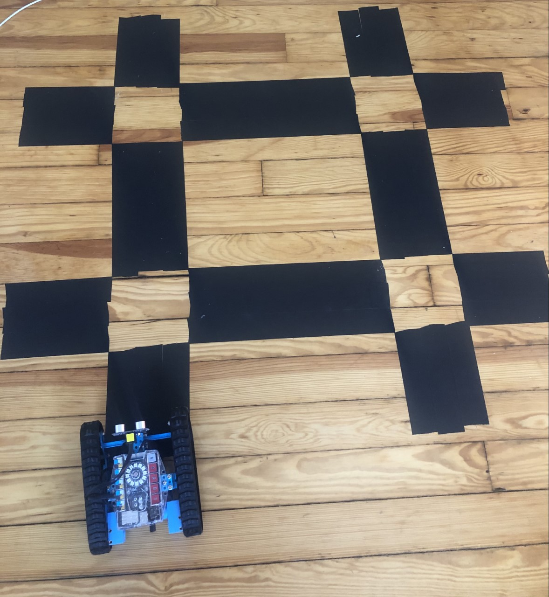
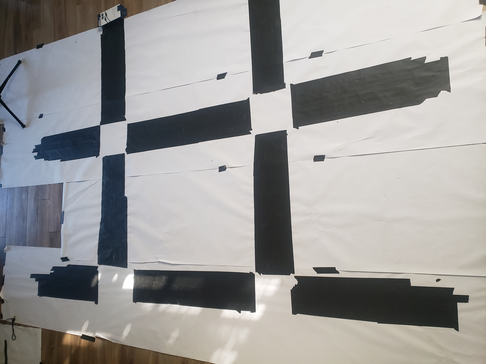

# Search Using Line Following and Sound

## Authors:
Nolan Bock, Connor Frazier, Matthew Pashkowsky, Andrew Wirth


## Problem Description:

This project explores having a line follower robot autonomously find its way through a simple line based maze to a sound emitting target. This project includes control program development in a Gazebo simulation environment and using the Makeblock mBot Ranger robot in a physical maze.

Proposed Solution:
  The solution was to have the robot follow the lines of the maze while constantly listening for the sound. While moving the control program would create an occupancy grid representing the sound levels at different points over the maze. The control program would then use this map to make decisions on which ways to turn at intersections. Therefore the robot would eventually find its way to the sound source.

  The control program used the academic papers (linked below) “Algorithm for Line Follower Robots to Follow Critical Paths with Minimum Number of Sensors” and “Auditory Occupancy Grids with a Mobile Robot” to fulfill the graduate student requirement. Techniques described in those papers were implemented directly and/or in part for the solution control program. Otherwise the code in this project was originally created with the help of the attributions listed below. There were no third party libraries directly used in this project.
## Instructions:
1. Set up Arduino IDE and the Mbot Ranger on you computer using these [instructions.](https://github.com/wirthdrewneu/RobotRangerSetUp)
2. Clone or download this project repo 
```terminal
$ git clone https://github.com/nbock/cs5335-nm.git
```
3. With the ranger connected upload ranger_serial_firmware.ino using Arduino IDE. IF there are errors, make sure board choice is Mega 2560 and the port is selected. Typically the port is dev/ttysUSB0 (the number at the end can be different. Linux recommended! For other operating systems, drivers may be needed.
4. Using the terminal run Make, navigate into brain, use the rg_brain executable for the physical robot and gz_brain executable for the Gazebo robot.
```terminal
$ make 
$ ./rg_brain
$ ./gz_brain
```
## Physical Robot World Examples:
  For the physical world try use thick lines and intersections about the width of the robot.






### Attributions:

https://github.com/NatTuck/cs5335hw-gazebo/tree/master/ranger. by Professor Nat Tuck Northeastern November 2020

 https://github.com/nbock/cs5335-nm/tree/master by Nolan Bock Northeastern November 2020

 https://docs.google.com/document/d/16uXDUmgN_9jM2sp_KGJtZZfQTpQ2-PzLDtjUFla_FcA/edit by Victor_Leung

 https://docs.google.com/document/d/1EpMWJo9pP2J_pstzXA-XHK8t00Z70SCZYwZ_Kl7VLuw/edit#heading=h.uop2tonh9y21 by Murray Elliot

 https://github.com/Makeblock-official/Makeblock-Libraries Examples by Makeblock

 https://stackoverflow.com/questions/6444842/efficient-way-to-check-if-stdstring-has-only-spaces by Mark B

 https://github.com/crayzeewulf/libserial/blob/master/examples/serial_stream_read_write.cpp by crayzeewulf

 https://github.com/crayzeewulf/libserial/blob/master/examples/serial_stream_read.cpp by creayzeewulf

 https://libserial.readthedocs.io/en/latest/tutorial.html

 https://citeseerx.ist.psu.edu/viewdoc/download?doi=10.1.1.864.4709&rep=rep1&type=pdf

 https://core.ac.uk/download/pdf/229655734.pdf
